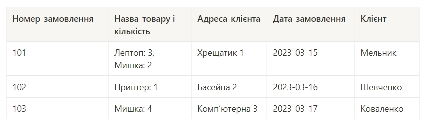
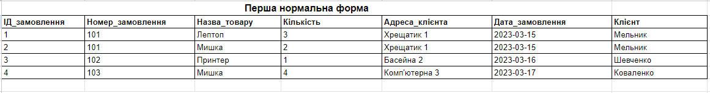
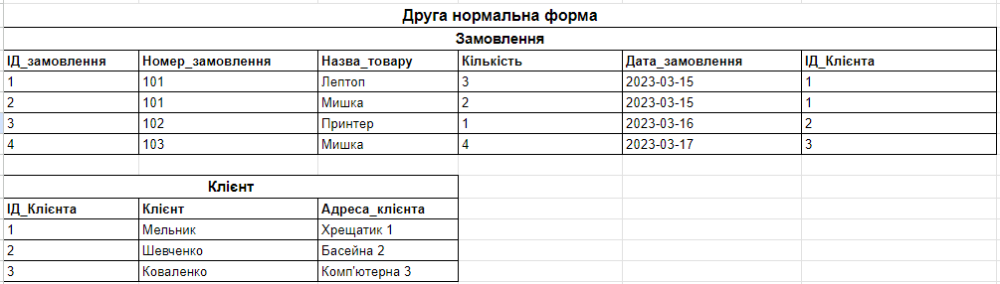
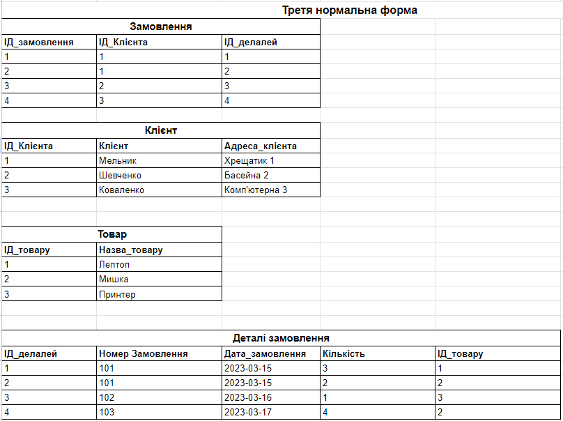
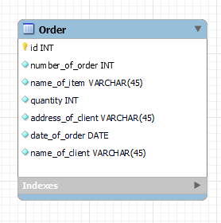
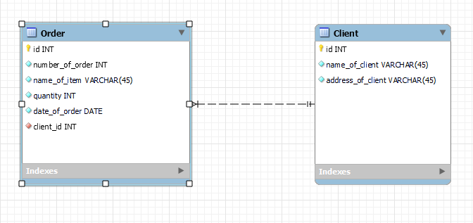
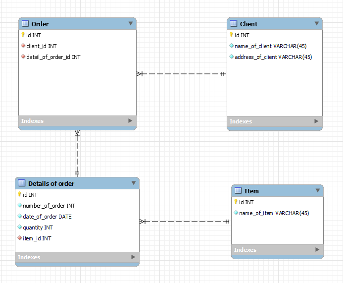
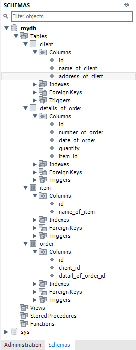

# Relational Databases

Початкова таблиця

Приведення початкової таблиці в першу нормальну форму.

Приведення таблиці в другу нормальну форму.

Приведення таблиці в третю нормальну форму.

# ER-діаграми отриманих таблиць.

ER-діаграма прершої нормальної форми

ER-діаграма другої нормальної форми

ER діаграма третьої нормальної форми

# Створена таблиця в базі даних.

